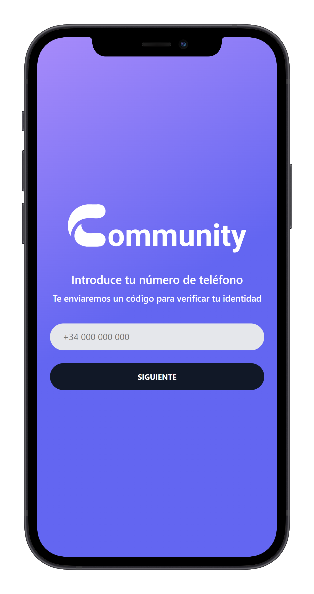
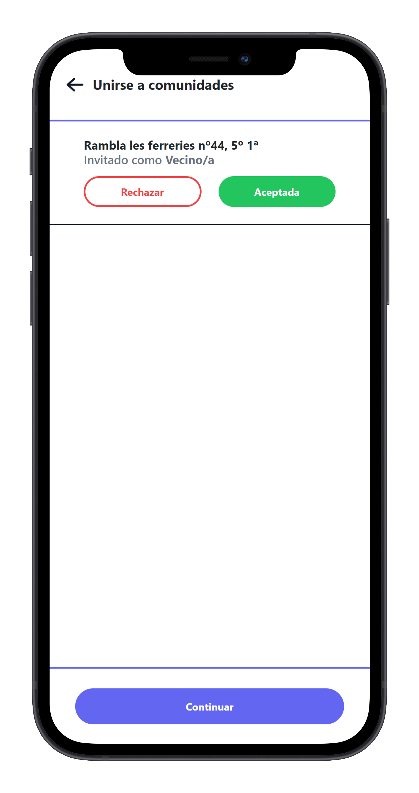
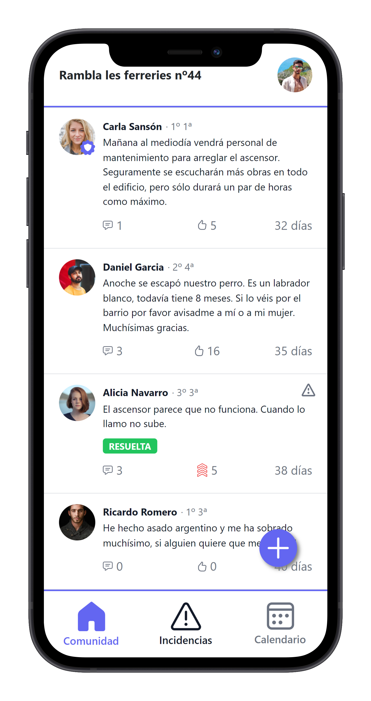
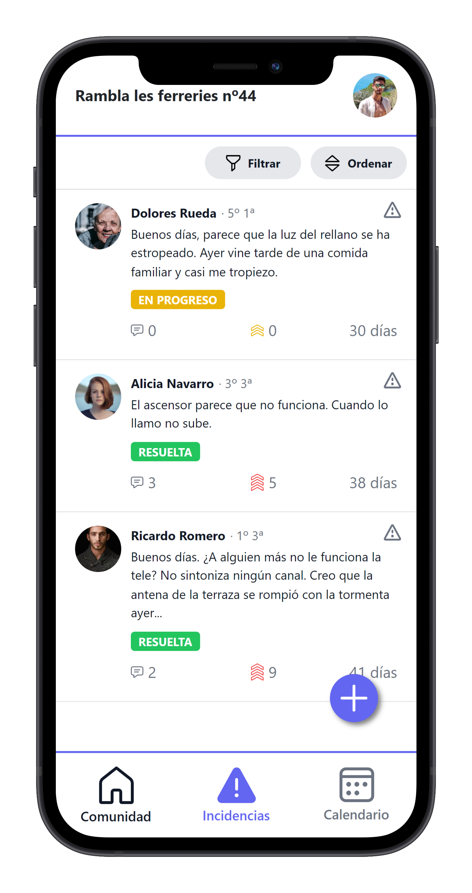
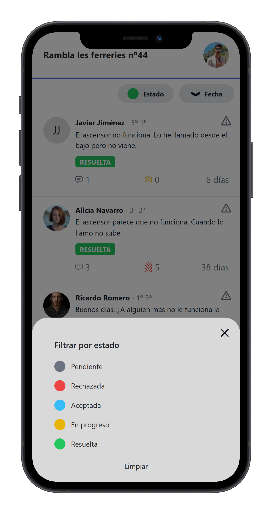
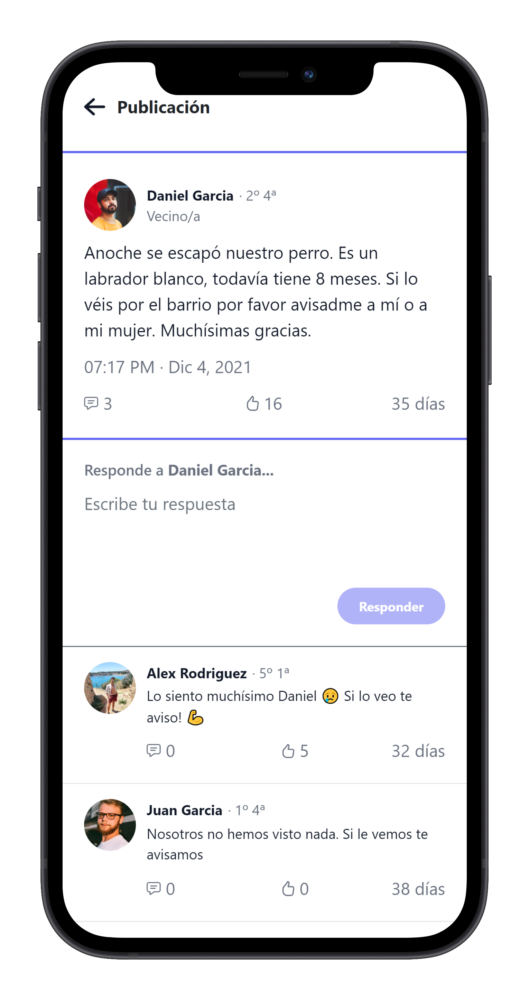
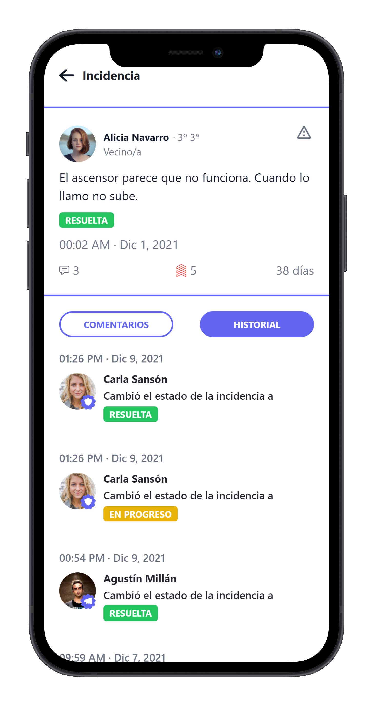

# `Freyja`

**`Community.bz main frontend`**

**`PAE-FIB startup project`**

# Screenshots

### Onboarding



### Invitation List



### Community Feed



### Issue Feed



### Issue Feed Filters



### Publication



### Issue


### Issue History



# Credits

-   [**`Alex Rodriguez`**](https://github.com/neoxelox)
-   [**`Agustín Millán`**](https://github.com/AgustinMJ)
-   [**`Marco Patiño`**](https://github.com/mpl1018)
-   [**`Carlos Sansón`**](https://github.com/csansoon)

# Setup

TODO

# Documentation

TODO

> **`NOTE`**
> `This repository is not finished and won't be developed further due to time constraints.`

# Directory structure

```
.
├── docs
├── public
└── src
    ├── assets
    │   ├── icons
    │   └── style
    ├── component
    │   ├── atom
    │   └── molecule
    ├── page
    ├── router
    ├── services
    │   ├── api
    │   │   ├── core
    │   │   ├── requests
    │   │   ├── responses
    │   │   └── services
    │   ├── model
    │   └── storage
    ├── store
    └── utils
```

# License

This project is licensed under the [Apache 2.0 License](https://opensource.org/licenses/Apache-2.0) - read the [LICENSE](LICENSE) file for details.
